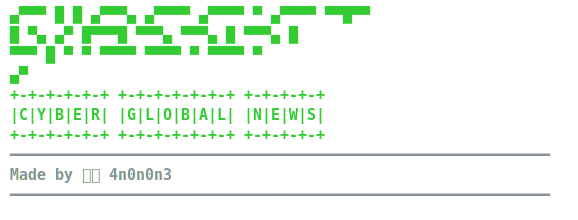
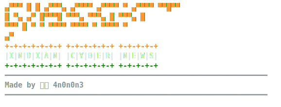

<p align="center">
  
</p>

<p align="center">
  
</p>

# Cyassist 🇮🇳 — Indian Cyber News

Daily cybersecurity news feed archive — auto-collected from 35+ RSS and Telegram sources. Built for the Indian bug bounty and security community.

Made with ❤️ by [**4n0n0n3**](https://github.com/4n0n0n3) (Pinaki Ranjan Patra) — [LinkedIn](https://www.linkedin.com/in/pinakirpatra/)

## Features

- **Live archive** — news fetched every 15 min via automated collector
- **Global edition** 🌐 — full cybersecurity news from 35+ sources
- **Indian edition** 🇮🇳 — filter by `-i` for India-relevant cybersecurity news
- **Searchable** — full-text grep across all articles
- **Public reader** — `reader.py` gives you terminal-based browsing

## Quick Start

```bash
git clone https://github.com/4n0n0n3/cyassist.git
cd cyassist

# Interactive reader
python3 reader.py

# India-specific news
python3 reader.py -i

# Headlines for last N days
python3 reader.py -H -d 3

# Search by keyword
python3 reader.py -s "ransomware"
```

<pre>
$ python3 reader.py</pre>


<pre>
$ python3 reader.py -i</pre>


## Sources

```
news/
├── rss/            # Security news, breaches, CVEs from 35+ sources
└── ... (organized by source → date)
```

## Article Format

```yaml
---
title: "Critical RCE in popular VPN appliance"
source: "rss/the-register"
date: "2026-06-11"
category: "news"
tags: [CVE, RCE, VPN, critical]
url: "https://theregister.com/..."
---
```

## Automation

News is auto-collected via a systemd service running the [intel-collector](https://github.com/4n0n0n3/intel-collector) pipeline. New articles arrive every 15-30 minutes.
