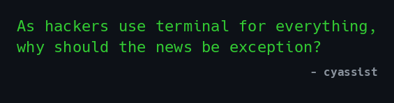

<p align="center">
  
</p>

<p align="center">
  
</p>

<p align="center">
  
</p>

# Cyassist v3.3.0 🇮🇳 — AI Bug Bounty Assistant + Cyber News

Daily cybersecurity news feed archive — auto-collected from 35+ RSS and Telegram sources — plus Triage Oracle, Rejection Analyzer, Adaptive Crawler, and Knowledge Graph for bug bounty workflow intelligence. Built for the Indian bug bounty and security community.

Made with ❤️ by [**4n0n0n3**](https://github.com/4n0n0n3) (Pinaki Ranjan Patra) — [LinkedIn](https://www.linkedin.com/in/pinakirpatra/)

## Features

- **Live archive** — news fetched every 15 min via automated collector
- **Global edition** 🌐 — full cybersecurity news from 35+ sources
- **Indian edition** 🇮🇳 — filter by `-i` for India-relevant cybersecurity news
- **Custom sources** — add any RSS feed with `--add-source`
- **Searchable** — full-text grep across all articles
- **Public reader** — `reader.py` gives you terminal-based browsing

## Quick Start

```bash
git clone https://github.com/4n0n0n3/cyassist.git
cd cyassist

# Interactive reader
python3 reader.py

# India-specific news
python3 reader.py -i

# Headlines for last N days
python3 reader.py -H -d 3

# Search by keyword
python3 reader.py -s "ransomware"
```

<pre>
$ python3 reader.py</pre>


<pre>
$ python3 reader.py -i</pre>


## Custom Sources

Add any RSS feed to your personal feed:

```bash
# Add a source
python3 reader.py --add-source myblog https://blog.example.com/rss

# Fetch articles from all custom sources
python3 reader.py --fetch-custom

# List your custom sources
python3 reader.py --list-custom

# Remove a source
python3 reader.py --remove-source myblog
```

Your custom sources get cached locally in `~/.local/share/cyassist/custom/` and appear alongside the built-in news in all views (`--today`, `--headlines`, `-i`, search, etc.). No extra dependencies — uses Python's built-in `urllib` and `xml.etree`.

## Sources

```
news/
├── rss/            # Security news, breaches, CVEs from 35+ sources
└── ... (organized by source → date)
```

## Article Format

```yaml
---
title: "Critical RCE in popular VPN appliance"
source: "rss/the-register"
date: "2026-06-11"
category: "news"
tags: [CVE, RCE, VPN, critical]
url: "https://theregister.com/..."
---
```

This is still under development so please be patient 🙏🏼
